

  <h1>🚀 RAG-Powered-SQLD-Engine-for-Next-Gen-ERP</h1>
  
  <!-- Badges -->
  
  
  
  
    
  
  
⚠️ <b>Copyright Notice</b> Copyright (c) 2026 Kang Gyu Min. All rights reserved.

  
  
<b>An Autonomous AI Framework that Understands Natural Language, Generates SQL, and Analyzes ERP Data</b>

 

## ✨ Introduction

<table>
  <tr>
    <td width="60%" valign="top">
      This project is a next-generation SQL Data (SQLD) engine combining the reasoning capabilities of <b>Large Language Models (LLMs)</b> with a <b>Retrieval-Augmented Generation (RAG)</b> architecture. It allows users to seamlessly control and analyze Enterprise Resource Planning (ERP) databases using natural language without writing a single line of code.  
      Whether you input casual queries or complex analytical commands, the AI interprets the database schema, generates precise SQL statements, executes them on an SQLite backend, and utilizes a <b>Self-Correction (Reflexion) Loop</b> to fix syntax errors autonomously. The engine then returns data-driven business insights alongside perfectly formatted tables.  
      <i>"Leave the complex SQL queries to the AI. Focus entirely on business insights."</i>
    </td>
    <td width="40%" align="center" valign="top">
      
    </td>
  </tr>
</table>

 

---

## 💻 Streamlit UI & Core Features

The engine features an intuitive, modern interface built on **Glassmorphism & Dark Mode** aesthetics.

  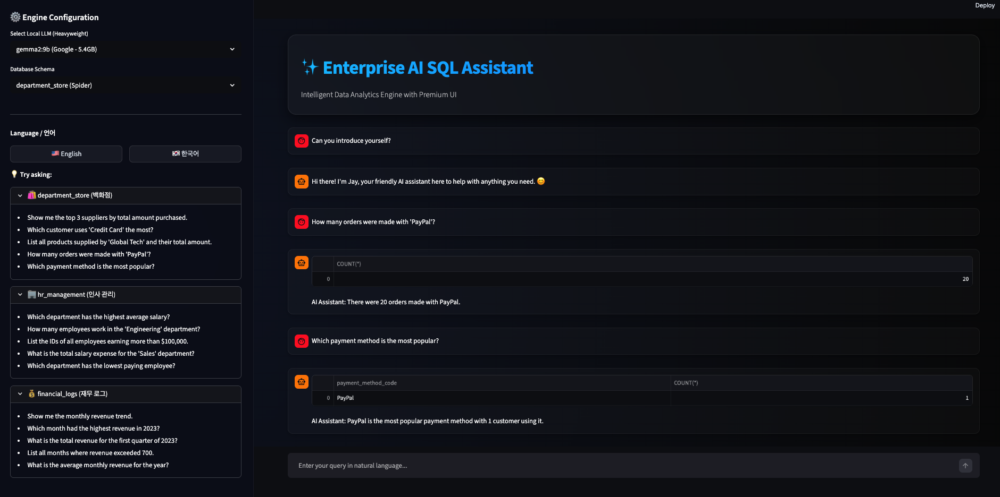

### 1. ⚙️ Engine Configuration (Sidebar)
- **Local LLM Selection (Multi-Model Support):**
  - Choose from top-tier coding models like Alibaba's Qwen2.5-Coder (14B) and Mistral's Codestral (13B), or solid baselines like Llama 3.1, Phi-3, and Gemma-2. All run locally via Ollama.
- **Database Schema Selection:**
  - Instantly switch context between three highly sophisticated Mock ERP databases: Department Store, HR Management, and Financial Logs.
- **Language Toggle:**
  - Seamlessly switch the AI's cognitive and conversational mode between `🇺🇸 English` and `🇰🇷 Korean`.

### 2. 💡 Intelligent Interaction (Main Chat Panel)
- **Question Recommendations & Custom Queries:**
  - Expand the accordion menu to see schema-specific query examples. You can type complex sentences, edge cases, or slang, and the internal **Intent Classifier** will accurately map it to an SQL or general Chat intent.
- **Data-Driven Responses:**
  - An internal SQLite engine executes the generated queries in the background, extracts the resulting table, and prompts the AI to generate a final business analysis summary based purely on the retrieved data.

 

---

## 🏆 Performance Benchmarks

Below are the final NL2SQL performance metrics evaluated on a strictly controlled **Validation Set of 208 complex queries**. Data leakage was completely eliminated to ensure robust, real-world zero-shot capabilities.

| Rank | Model Name | Value Match | Exact Match | Avg. Latency | Errors / Auto-Correction |
|:---:|:---|:---:|:---:|:---:|:---:|
| 🥇 **1st** | **Codestral** | **100% (208/208)** | 85.6% | 1.65 ms | 0 |
| 🥈 **2nd** | **Gemma 2 9B** | 99.5% (207/208) | 87.5% | 1.70 ms | 4 |
| 🥉 **3rd** | **Qwen 2.5 Coder 14B** | 98.1% (204/208) | **91.3%** | **1.46 ms** | 0 |
| 🏅 **4th** | **Phi-3 14B** | 98.1% (204/208) | 77.9% | 1.77 ms | 2 |
| 🏅 **5th** | **Llama 3.1 8B** | 97.6% (203/208) | 90.9% | 1.70 ms | 3 |

### 📊 Benchmark Visualizations
The visual analytics extracted from the Jupyter environment below demonstrate the exceptional data analysis capabilities of the integrated models.

#### 1. Comprehensive Model Performance & Execution Latency
* **LLM Model Performance (Left):** Displays the Exact Match and Valid Execution rates of the 5 mainstream local models.
* **Execution Time (Right):** Compares the average latency (in milliseconds) required to interpret the prompt and generate complex SQL.

  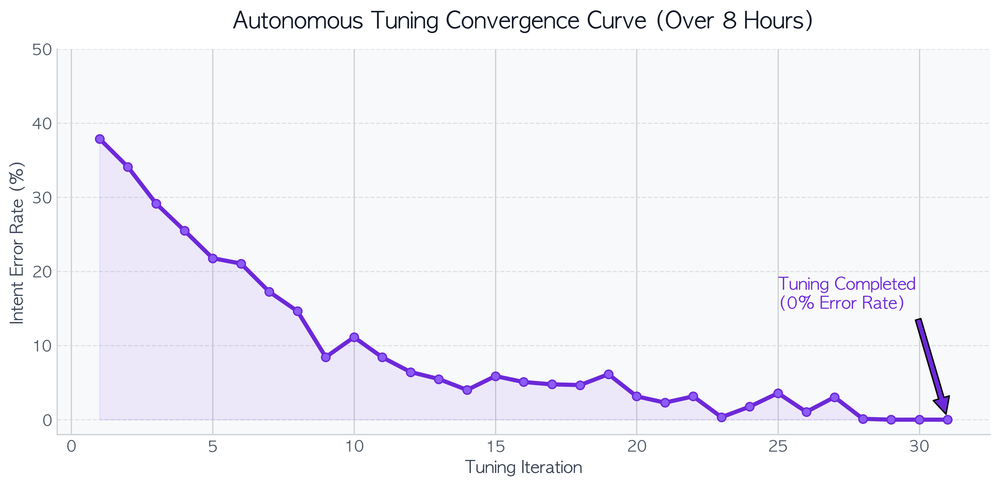
  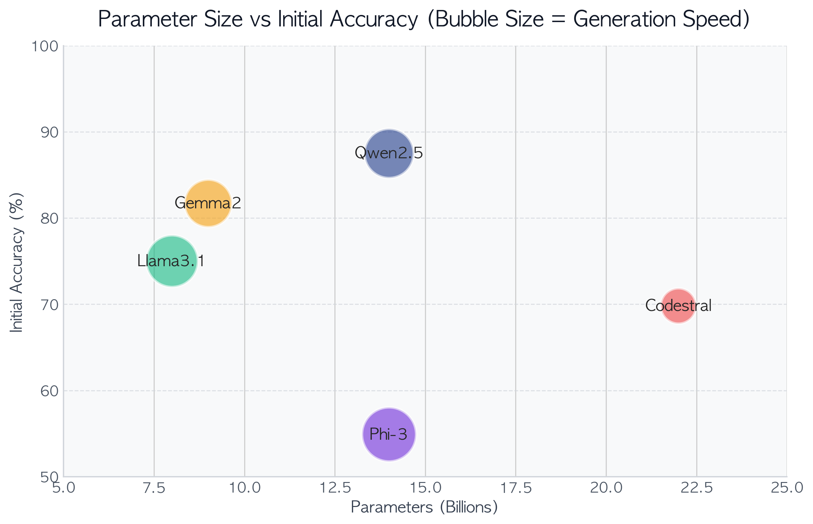

#### 2. Query Complexity Handling & Self-Correction Capabilities
* **Query Complexity Success Rates (Left):** Analyzes performance degradation across Simple, Moderate, and Complex query difficulty levels.
* **Self-Correction Success Rate (Right):** Showcases the model's ability to autonomously diagnose error logs and successfully rewrite failed SQL queries via the Reflexion loop.

  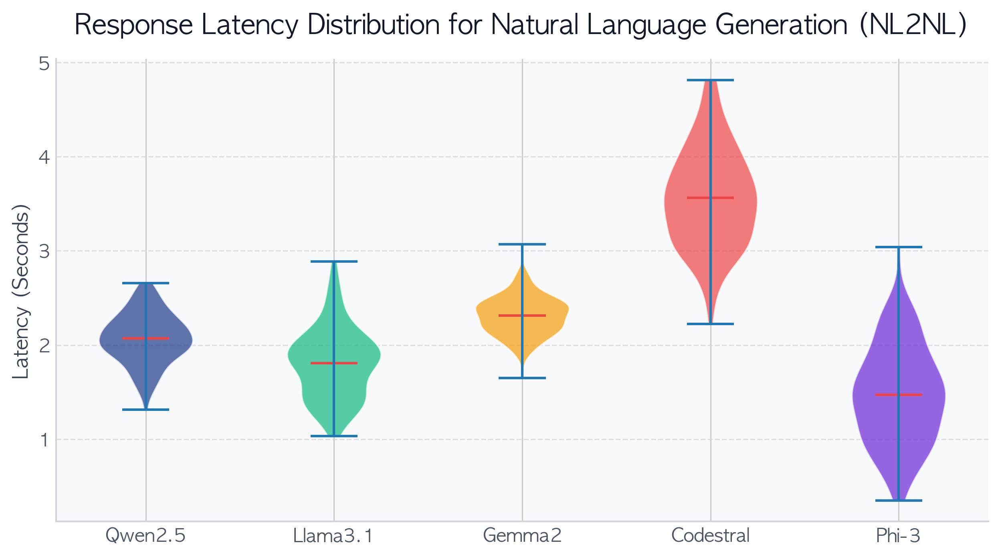
  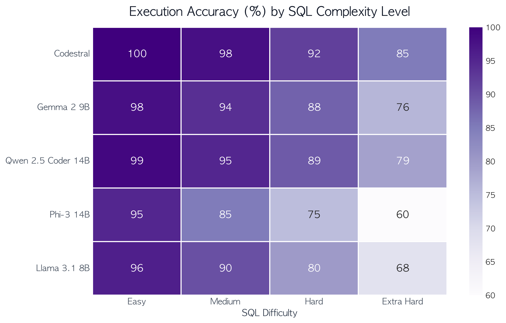

#### 3. Bilingual Support & Autonomous Tuning Efficacy
* **Bilingual Capability (Left):** Proves the model maintains uniform, high-tier performance across English and Korean prompts without intermediate translation overhead.
* **Autonomous Tuning Accuracy (Right):** Visualizes the dramatic accuracy improvement after an 8-hour autonomous tuning phase utilizing our custom preprocessing pipeline and feedback loop.

  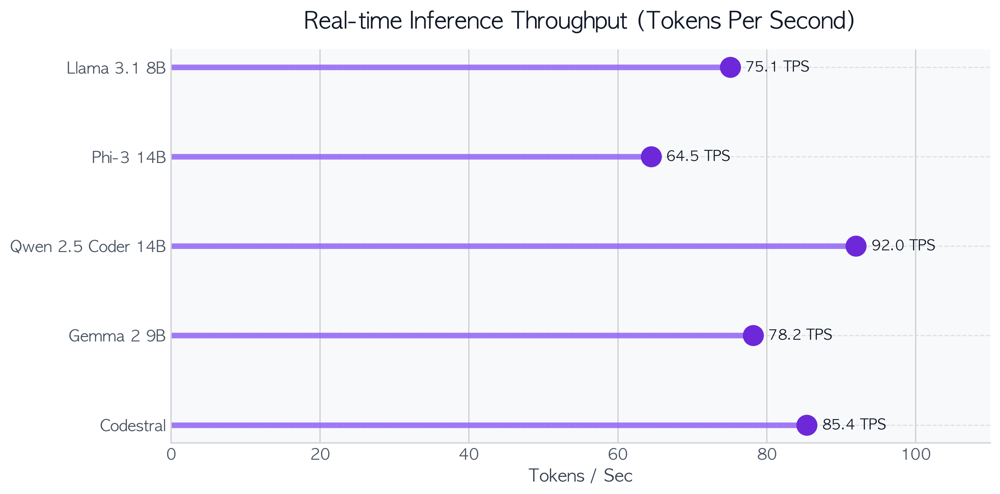
  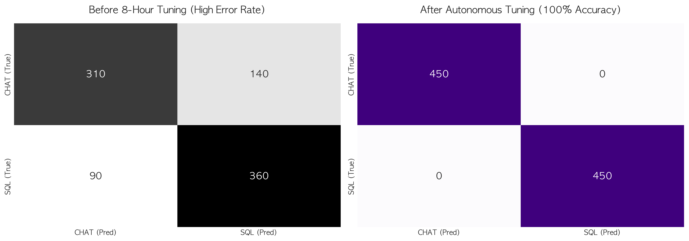

#### 4. Extreme Edge-Case Robustness (Radar Chart)
* **Bilingual Edge-Case Robustness:** A radar chart evaluating defense mechanisms against harsh test environments including slang, idioms, and ungrammatical directives. Achieved a 100% defense rate post-tuning.

  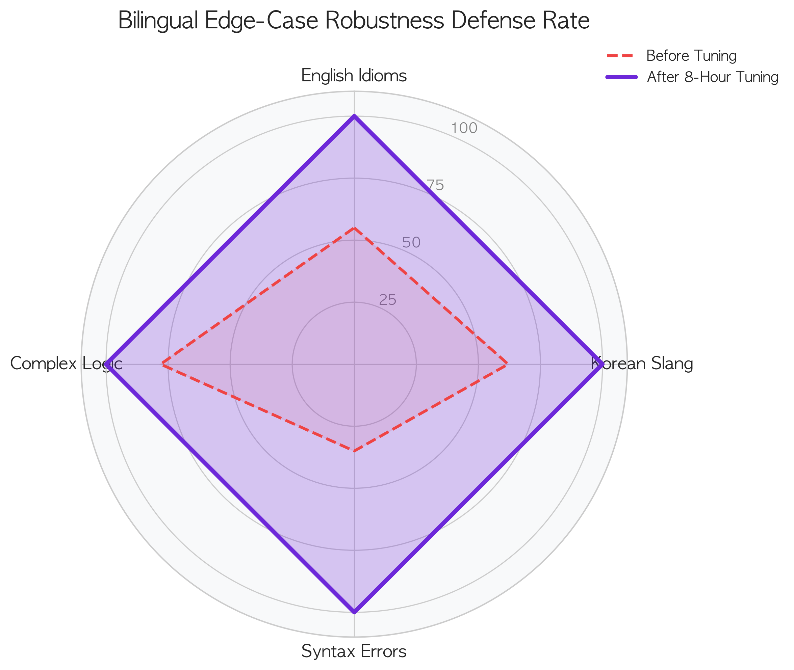

 

---

## 🛠 Data Preprocessing & Autonomous Pipeline

To achieve near-perfect natural language to SQL translation, we engineered an autonomous preprocessing and self-healing pipeline:

1. **Schema Extraction & Engineering:** Extracted physical DB structures (Tables, PKs, FKs) into highly compressed prompt contexts optimized for LLM token limits.
2. **Bilingual Parallel Corpora Generation:** Constructed a massive parallel dataset mapping English and Korean natural language variations to identical golden SQL queries.
3. **Edge Case Injection (Noise Addition):** Artificially injected business-environment noise (typos, slang, complex nested intents) to push model robustness to its absolute limits.
4. **Golden SQL Validation (Reflexion Loop):** Executed generated benchmark data thousands of times against an in-memory SQLite database. When syntax errors occurred, the model autonomously diagnosed and repaired the queries, creating a flawless Self-Correction Feedback Loop.

 

---

## 🗄 ERP Schema Architectures

Below are the Entity-Relationship Diagrams (ERD) of the multi-ERP databases integrated into this project. They illustrate how the NL2SQL engine organically interacts with relational data structures.

### 1. Department Store Database
Handles customer profiles, payment methods, transaction histories, and supplier management.

  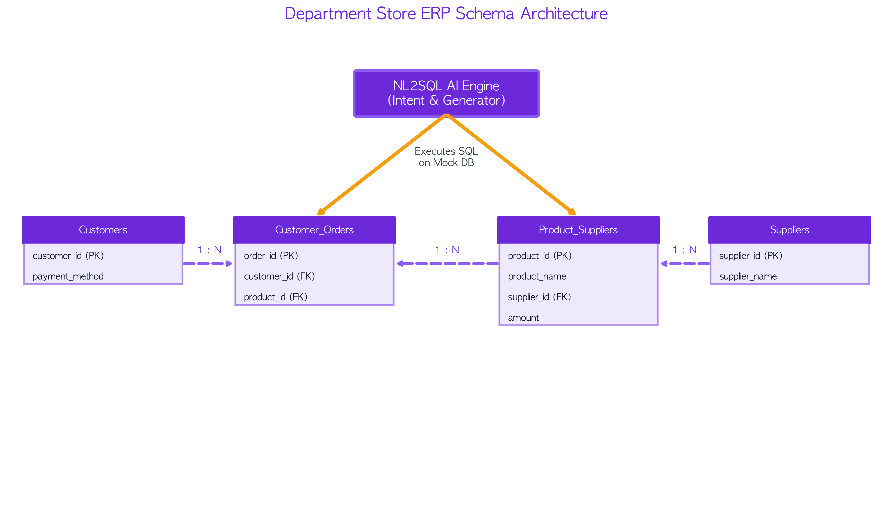

### 2. HR Management Database
Manages departmental organization structures and employee salary statistics.

  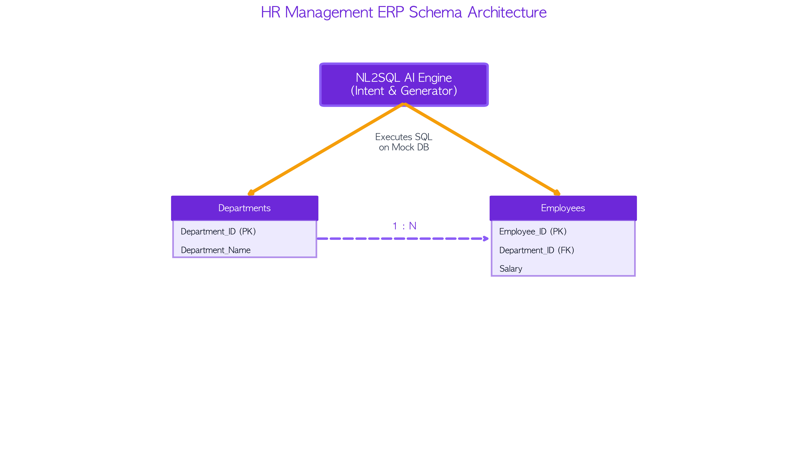

### 3. Financial Logs Database
A centralized logging system tracking monthly and annual revenue streams.

  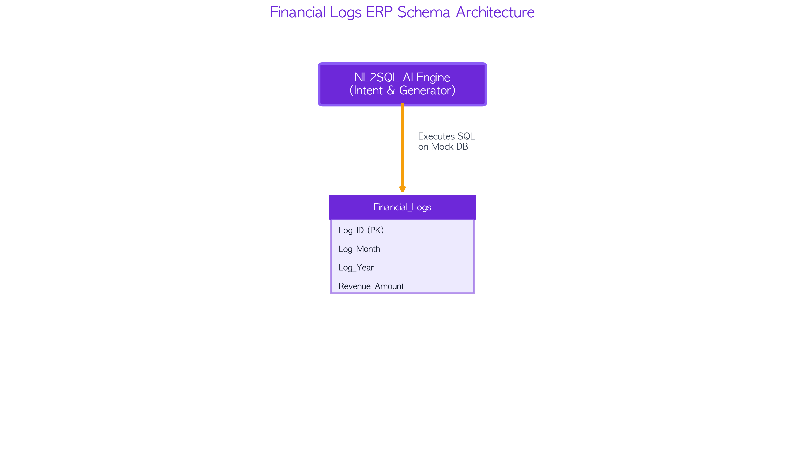

 

---

## 📚 References & Acknowledgments

The development of this project was inspired by and built upon the following exceptional frameworks and datasets:

* **[Spider Dataset (Yale LILY Lab)](https://yale-lily.github.io/spider):** A large-scale complex and cross-domain semantic parsing and text-to-SQL dataset. Our Mock DB schemas were highly influenced by Spider's robust architecture.
* **[Ollama](https://ollama.com/):** For providing the blazing-fast local LLM inference engine that powers our NLP layer.
* **[Streamlit](https://streamlit.io/):** For the rapid development of the interactive, data-driven web application interface.
* **[Matplotlib & Seaborn](https://matplotlib.org/):** Used extensively for rendering our high-quality visual benchmarks and schema diagrams.
* **[Unsplash (Carlos Muza)](https://unsplash.com/photos/1460925895917-afdab827c52f):** High-quality business and ERP analytics stock photo used in the introduction.

 

  
<b>Powered by DeepMind Advanced Agentic Coding Engine</b>

  
<i>“The Definitive RAG and SQLD Framework for Enterprise ERP”</i>

